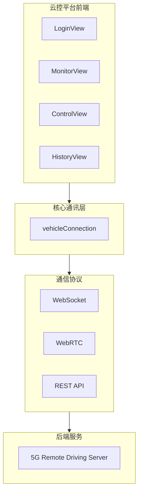
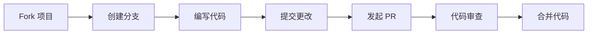

<div align="center">


# 🚗 5G 远程驾驶云控平台

### 5G Remote Driving Cloud Platform

<p>
  
  
  
  
  
  
  
</p>

<h3>实时监控 · 远程控制 · 视频流传输 · 3D地图可视化</h3>

<p>
  <a href="#-快速开始"><b>快速开始</b></a> • 
  <a href="#-功能特性"><b>功能特性</b></a> • 
  <a href="#-项目结构"><b>项目结构</b></a> • 
  <a href="#-贡献指南"><b>贡献指南</b></a>
</p>


</div>

---

## 🎯 项目简介

基于 **5G 低延迟网络** 的远程驾驶云控平台，实现车辆的实时监控与远程控制。通过 WebRTC 技术传输高清视频流，结合百度地图 3D 可视化，打造沉浸式远程驾驶体验。

---

## ✨ 功能特性

<table>
<tr>
<td width="50%" valign="top">

### 🎥 实时视频流
- ✔️ WebRTC 低延迟视频传输
- ✔️ 支持模拟视频源切换
- ✔️ 多路视频同步播放
- ✔️ 自适应码率调节

</td>
<td width="50%" valign="top">

### 🗺️ 3D 地图可视化
- ✔️ 百度地图 GL JS SDK
- ✔️ 车辆实时位置追踪
- ✔️ 3D 视角与车辆跟随
- ✔️ 轨迹回放功能

</td>
</tr>
<tr>
<td width="50%" valign="top">

### 🎮 远程驾驶控制
- ✔️ 实时方向盘控制
- ✔️ 仪表盘数据展示
- ✔️ 低延迟指令传输
- ✔️ 安全接管机制

</td>
<td width="50%" valign="top">

### 📊 数据监控大屏
- ✔️ 车辆遥测数据展示
- ✔️ 历史数据回放
- ✔️ 日志记录与分析
- ✔️ 异常告警系统

</td>
</tr>
</table>

---

## 🏗️ 系统架构

<div align="center">



</div>

---

## 📁 项目结构

```
📦 cloudside/
├── 📄 index.html              # 入口 HTML（百度地图 SDK）
├── 📄 index.tsx               # React 入口
├── 📄 App.tsx                 # 主应用逻辑
├── 📄 types.ts                # TypeScript 类型定义
├── 📄 metadata.json           # 权限配置
│
├── 📂 services/               # 🔧 后端通讯层
│   └── 🔌 vehicleConnection.ts
│       ├── WebSocket 遥测数据接收
│       ├── WebRTC 视频流连接
│       └── 实时数据同步
│
├── 📂 views/                  # 🖼️ 页面视图
│   ├── 🔐 LoginView.tsx       # 登录界面
│   ├── 📺 MonitorView.tsx     # 实时监控
│   ├── 🎮 ControlView.tsx     # 远程驾驶舱
│   └── 📜 HistoryView.tsx     # 历史回放
│
└── 📂 components/             # 🧩 通用组件
    ├── 📹 VideoFeed.tsx       # 视频播放器
    └── 🗺️ MapContainer.tsx    # 地图组件
```

---

## 🚀 快速开始

### 📋 前置条件

| 依赖 | 版本 | 说明 |
|:----:|:----:|:-----|
|  | >= v16 | JavaScript 运行时 |
|  | 最新版 | 包管理器 |
|  | 最新版 | 版本控制 |

### 🔧 环境配置

<details>
<summary><b>📥 安装 Node.js</b></summary>

#### Windows

1. 访问 [Node.js 官网](https://nodejs.org/)
2. 下载 **LTS（长期支持版）** 安装包
3. 双击安装包，一路点击 `Next` 完成安装
4. 打开终端验证安装：
   ```bash
   node -v    # 显示版本号则安装成功
   npm -v     # npm 会随 Node.js 一起安装
   ```

#### macOS

```bash
# 方式一：使用 Homebrew（推荐）
brew install node

# 方式二：官网下载安装包
# 访问 https://nodejs.org/ 下载 macOS 安装包
```

#### Linux (Ubuntu/Debian)

```bash
# 使用 apt 安装
sudo apt update
sudo apt install nodejs npm

# 或使用 nvm 安装（推荐，可管理多版本）
curl -o- https://raw.githubusercontent.com/nvm-sh/nvm/v0.39.0/install.sh | bash
source ~/.bashrc
nvm install --lts
```

</details>

<details>
<summary><b>📥 安装 Git</b></summary>

#### Windows

1. 访问 [Git 官网](https://git-scm.com/download/win)
2. 下载 Windows 安装包
3. 运行安装程序，使用默认选项即可
4. 右键菜单出现 `Git Bash Here` 则安装成功
5. 验证安装：
   ```bash
   git --version
   ```

#### macOS

```bash
# 方式一：使用 Homebrew
brew install git

# 方式二：Xcode 命令行工具
xcode-select --install
```

#### Linux (Ubuntu/Debian)

```bash
sudo apt update
sudo apt install git

# 验证安装
git --version
```

</details>

<details>
<summary><b>⚙️ Git 初始配置（首次使用必做）</b></summary>

```bash
# 设置用户名
git config --global user.name "你的用户名"

# 设置邮箱
git config --global user.email "你的邮箱@example.com"

# 查看配置
git config --list
```

</details>

### ⚡ 安装

```bash
# 📥 克隆项目
git clone https://github.com/Cecilia-Stark/5G-Remote-Driving-Cloud-Platform.git

# 📂 进入目录
cd 5G-Remote-Driving-Cloud-Platform

# 📦 安装依赖
npm install

# 🚀 启动开发服务器
npm run dev
```

### 📜 可用脚本

| 命令 | 描述 |
|:-----|:-----|
| `npm run dev` | 🚀 启动开发服务器 |
| `npm run build` | 📦 构建生产版本 |
| `npm run preview` | 👀 预览生产构建 |
| `npm run lint` | 🔍 代码检查 |

---

## 🛠️ 技术栈

<div align="center">

| 类别 | 技术 |
|:----:|:----:|
| 前端框架 |  |
| 构建工具 |  |
| 类型系统 |  |
| 视频传输 |  |
| 数据通信 |  |
| 地图服务 |  |
| 图标库 |  |

</div>

---

## 🤝 贡献指南

我们欢迎所有形式的贡献！

<div align="center">



</div>

### 贡献步骤

| 步骤 | 命令 |
|:----:|:-----|
| 1️⃣ | 🍴 Fork 本项目 |
| 2️⃣ | `git checkout -b feature/AmazingFeature` |
| 3️⃣ | `git commit -m 'Add some AmazingFeature'` |
| 4️⃣ | `git push origin feature/AmazingFeature` |
| 5️⃣ | 🎉 发起 Pull Request |

---

## 📄 许可证

<div align="center">

本项目采用 [MIT](LICENSE) 许可证

</div>

---

## 📞 联系方式

<div align="center">

[](https://github.com/Cecilia-Stark)

</div>

---

<div align="center">

### ⭐ 如果这个项目对你有帮助，请给一个 Star 支持一下！


**Made with ❤️ by Cecilia Stark**

</div>